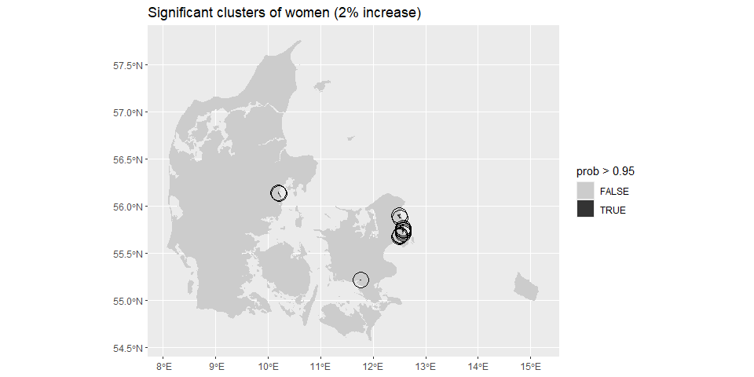

Untitled
================

## code for hotspot detection

This is code for …

## Data management

``` r
library(tidyverse)
```

    ## Warning: pakke 'purrr' blev bygget under R version 4.3.1

    ## ── Attaching core tidyverse packages ──────────────────────── tidyverse 2.0.0 ──
    ## ✔ dplyr     1.1.2     ✔ readr     2.1.4
    ## ✔ forcats   1.0.0     ✔ stringr   1.5.0
    ## ✔ ggplot2   3.4.2     ✔ tibble    3.2.1
    ## ✔ lubridate 1.9.2     ✔ tidyr     1.3.0
    ## ✔ purrr     1.0.2     
    ## ── Conflicts ────────────────────────────────────────── tidyverse_conflicts() ──
    ## ✖ dplyr::filter() masks stats::filter()
    ## ✖ dplyr::lag()    masks stats::lag()
    ## ℹ Use the conflicted package (<http://conflicted.r-lib.org/>) to force all conflicts to become errors

``` r
library(spaMM)
```

    ## Registered S3 methods overwritten by 'registry':
    ##   method               from 
    ##   print.registry_field proxy
    ##   print.registry_entry proxy
    ## spaMM (Rousset & Ferdy, 2014, version 4.2.1) is loaded.
    ## Type 'help(spaMM)' for a short introduction,
    ## 'news(package='spaMM')' for news,
    ## and 'citation('spaMM')' for proper citation.
    ## Further infos, slides, etc. at https://gitlab.mbb.univ-montp2.fr/francois/spamm-ref.

``` r
library(sf)
```

    ## Linking to GEOS 3.11.1, GDAL 3.6.2, PROJ 9.1.1; sf_use_s2() is TRUE

``` r
library(dagirlite)
```

    ## Warning: pakke 'dagirlite' blev bygget under R version 4.3.2

``` r
data("geo_sogne")

geo_sogne$expected_women <- geo_sogne$population * (sum(geo_sogne$women) / sum(geo_sogne$men) / 2)

nbs <- st_intersects(geo_sogne, geo_sogne, sparse = FALSE)
nbs[] <- +nbs
geo_sogne$id <- 1:nrow(geo_sogne)

fit <- fitme(women ~ 0 + offset(log(expected_women)) + adjacency(1|id), adjMatrix = nbs, 
             data = geo_sogne, family = "poisson", method = "REML")
```

    ## If the 'RSpectra' package were installed, an extreme eigenvalue computation could be faster.
    ## (One-time message:) Choosing matrix methods took 1.5 s.
    ##   If you perform many similarly costly fits, setting the method
    ##   by control.HLfit=list(algebra=<"spprec"|"spcorr"|"decorr">) may be useful,
    ##   see help("algebra"). "spprec" has been selected here.

``` r
pred <- predict(fit, variances = list(linpred = TRUE, disp = TRUE, respVar = TRUE))

geo_sogne$pred <- pred[]
geo_sogne$fitted <- fitted(fit)
geo_sogne$pv <- attr(pred, which = "predVar")
geo_sogne$prob_02 <- pnorm(log(1.02), mean = log(geo_sogne$pred) - log(geo_sogne$expected_women), sd = sqrt(geo_sogne$pv), lower.tail = FALSE)
```

### Raw rates

<!-- -->

### Smoothed using the CAR model

<!-- -->

### Detected hotspots

<!-- -->
