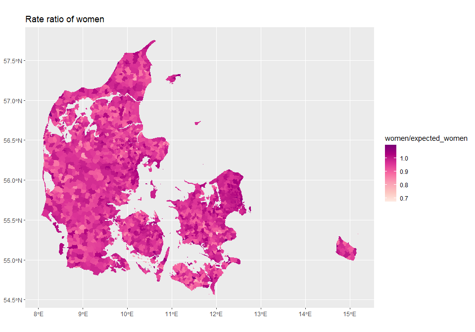

Hotspot detection using conditional autoregressive poisson model in R
================

## Background

Detecting hotspots of increased incidence in small geographical units is
usefull in investigating environmental exposures. The challenge is
determnining when something is increased across an area.

## Data management

We calculate expected number of women in a parish as the national rate
times population of each parish. Then the model is fitted.

``` r
library(tidyverse)
library(spaMM)
library(sf)
library(dagirlite)

data("geo_sogne")

geo_sogne$expected_women <- geo_sogne$population * (sum(geo_sogne$women) / sum(geo_sogne$men) / 2)

nbs <- st_intersects(geo_sogne, geo_sogne, sparse = FALSE)
nbs[] <- +nbs
geo_sogne$id <- 1:nrow(geo_sogne)

fit <- fitme(women ~ 0 + offset(log(expected_women)) + adjacency(1|id), adjMatrix = nbs, 
             data = geo_sogne, family = "poisson", method = "REML")

pred <- predict(fit, variances = list(linpred = TRUE, 
                                      disp = TRUE, 
                                      respVar = TRUE))

geo_sogne$pred <- pred[]
geo_sogne$fitted <- fitted(fit)
geo_sogne$pv <- attr(pred, which = "predVar")

geo_sogne$prob_01 <- pnorm(log(1.005), 
                           mean = log(geo_sogne$pred) - log(geo_sogne$expected_women), 
                           sd = sqrt(geo_sogne$pv), lower.tail = FALSE)

geo_sogne$prob_02 <- pnorm(log(1.02), 
                           mean = log(geo_sogne$pred) - log(geo_sogne$expected_women), 
                           sd = sqrt(geo_sogne$pv), lower.tail = FALSE)
```

### Raw rates

Examining raw rates gives little hints in clusters as small parrishes
might have high/low rates by change, therefore smoothing using a CAR
model is adventageous.

<!-- -->

### Smoothed using the CAR model

Using a CAR model greatly reduces the range of rates as outliers are
penalized.

<!-- -->

### Detected hotspots

If we choose to look for small levels of difference we find increased
rates of women close to large cities, and in high income areas. This
makes intutive sense.

<!-- -->
